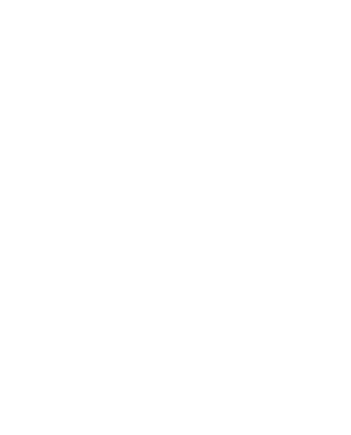

  

<h1 align="center">Melanie Berberette</h1>

  <strong>Web &amp; UX Designer</strong> · Denver, Colorado

  Good design is not decoration. It is the shortest path between a person and what they came to do —
  built once, documented properly, and beautiful enough that the team defends it.

  
  &nbsp;
  

---

Twelve years of product, brand, and web design — most of it spent on the parts that decide whether an interface feels finished: information architecture, edge-case states, and design systems that outlive the team that built them. Currently Senior Web + UX Designer at [EveryPeer](https://everypeer.com), and taking on independent design-partner and sprint engagements through the studio.

I design in Figma and build what I design: marketing sites in vanilla HTML/CSS/JS with GSAP and Lenis, and product work in React and Next.js. The repos here are the build side of that practice.

## Selected projects

<table>
  <thead>
    <tr>
      <th align="left">Project</th>
      <th align="left">What it is</th>
      <th align="left">Built with</th>
      <th align="left">Links</th>
    </tr>
  </thead>
  <tbody>
    <tr>
      <td><strong>Eaton Home</strong></td>
      <td>A two-person household dashboard for home upgrade projects: ranked priorities with drag-and-drop, per-project budgets and price-history graphs, recurring home care, a live activity feed, and a draggable 3D model of the house with upgrade markers. Realtime sync between members via Supabase.</td>
      <td>Next.js 16 · TypeScript · Tailwind CSS 4 · shadcn/ui · GSAP · react-three-fiber · Supabase</td>
      <td nowrap><a href="https://github.com/mjberberette/eaton-home">Repo</a> · <a href="https://eaton-home.vercel.app">Live</a> · <a href="https://github.com/mjberberette/eaton-home/tree/main/portfolio">Case study</a></td>
    </tr>
    <tr>
      <td><strong>PeerTracer</strong></td>
      <td>Multi-page marketing site for EveryPeer's PeerTracer product — home, getting started, tokenomics, about, contact, and terms — with live market-cap and network-path statistics on the landing page.</td>
      <td>HTML · CSS · vanilla JavaScript</td>
      <td nowrap><a href="https://github.com/mjberberette/PeerTracer-V3">Repo</a></td>
    </tr>
    <tr>
      <td><strong>PeerTracer Splash</strong></td>
      <td>Single-screen pre-launch splash page for PeerTracer. The lightweight precursor to the full site above.</td>
      <td>HTML · CSS</td>
      <td nowrap><a href="https://github.com/mjberberette/PeerTracer-Splash">Repo</a></td>
    </tr>
  </tbody>
</table>

<!-- TODO(Melanie): only three public repos exist on github.com/mjberberette right now.
     Add rows here as more work goes public, or make selected private repos public to feature them. -->

More design work — brand identity, an editorial CMS, commerce, and healthcare service design — lives on the site: [melanieberberette.design](https://melanieberberette.design). Case studies with research and post-launch numbers are available on request.

## Tools I think in

  
  
  
  

  
  
  
  
  
  
  
  

  
  
  
  

## What I'm hired to do

- **Product & UX design** — information architecture, flows, interface design, and usability testing for complex products.
- **Design systems** — token architecture, component APIs, documentation, and the governance that keeps them alive after handoff.
- **Brand & art direction** — identity systems designed for screens first, with motion that carries the personality.
- **Web design & build** — marketing sites and portfolios designed and built by the same pair of hands.

<!--
Optional GitHub stats card (rendered by the third-party github-readme-stats service on Vercel).
Left off by default: it is externally hosted and there are only three public repos to count yet.
Uncomment to enable:

  

-->

  Booking projects for Q4 · <a href="https://melanieberberette.design">melanieberberette.design</a>

